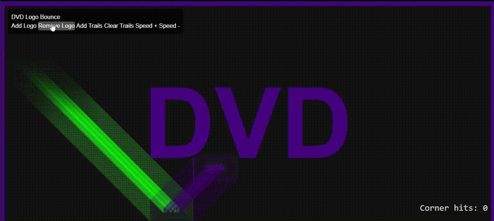

## 📸 Preview

 
---

# 🎬 DVD Logo Bounce

A fun, nostalgic animation project that recreates the classic bouncing DVD logo, with a modern twist using HTML, CSS (Tailwind included), and JavaScript. The logo bounces around the screen, changes color on collision, and even tracks corner hits. You can add multiple logos, enable trailing effects, and control speed dynamically through a simple UI.

---

## Live Page

[](https://teddyo323.github.io/Logo-Bounce-Screensaver/)

---


## 🌟 Features

* 🖼️ **Animated DVD Logo** that bounces within the browser viewport
* 🌈 **Dynamic color changes** on each wall collision
* 🟰 **Corner hit counter** that tracks when the logo hits a corner
* 🧭 **Interactive controls** to:

  * Add or remove logos
  * Enable or disable trails (motion trails)
  * Increase or decrease bounce speed
* 🐾 **Trails system** with smooth fade-out for a cool motion effect
* ⚡ Powered by **Vanilla JavaScript** and **TailwindCSS**

---

## 🛠️ Technologies Used

* HTML5
* CSS3 (with TailwindCSS via CDN)
* JavaScript (ES6+)
* SVG for scalable logo rendering

---

## 🚀 Getting Started

1. **Clone or download the repository:**

   ```bash
   git clone https://github.com/TeddyO323/Logo-Bounce-Screensaver.git
   ```

2. **Open the file in your browser:**

   Open `index.html` in any modern browser (Chrome, Firefox, Edge, Safari).

   Alternatively, if you're using VSCode, you can install the *Live Server* extension and right-click → “Open with Live Server”.

---

## 🎮 How to Use

Once the page loads:

* 💥 The DVD logo will begin bouncing automatically.
* 🟣 Use the control panel in the top-left corner:

  * `Add Logo`: Clone another bouncing DVD logo
  * `Remove Logo`: Remove one logo instance
  * `Add Trails`: Enable motion trails for all logos
  * `Clear Trails`: Disable and clear all motion trails
  * `Speed +`: Increase the bounce speed
  * `Speed -`: Decrease the bounce speed
* 🧮 Keep an eye on the **corner hit count** in the bottom-right.

---

## 📦 File Structure

```plaintext
dvd-logo-bounce/
│
├── index.html         # Main HTML file containing all logic, styles, and markup
├── README.md          # Project documentation
```

> Note: All scripts and styles are inline for simplicity, but they can be modularized into separate files for scalability.

---

## 🧠 Fun Fact

The animation includes logic to **detect when the DVD logo hits a corner**, and increments a counter — a subtle nod to everyone's favorite moment watching a DVD screen saver!

---

## 📜 License

This project is licensed under the [MIT License](LICENSE).

---

## 🤝 Contributing

Pull requests and suggestions are welcome! Feel free to fork this repo and enhance it — maybe add sound effects, logo rotation, or different themes.

---

## 👨‍💻 Author

Made with ❤️ by [Your Name](https://github.com/your-username)

---

Let me know if you'd like this rewritten for GitHub Pages or with separate JS/CSS files in mind!
